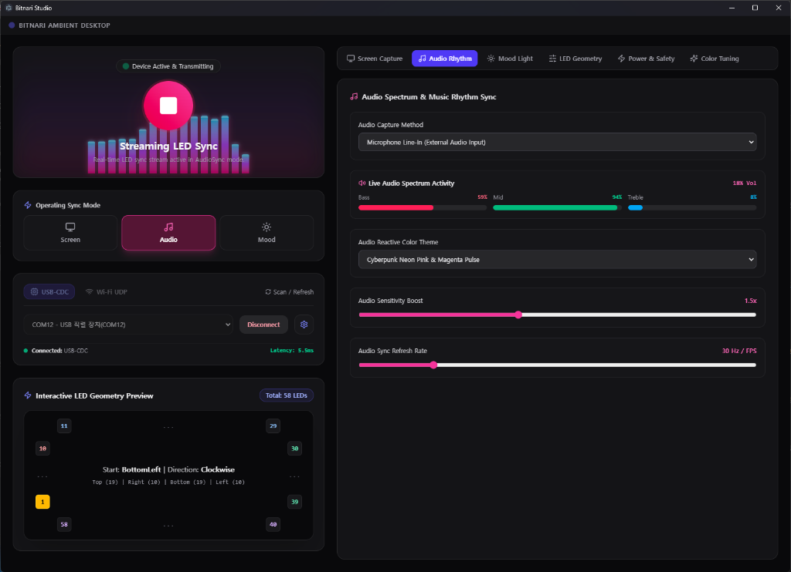

[English](README.md)

# Bitnari Studio

Bitnari Studio는 PC 환경을 위한 오픈소스 기반 앰비언트 라이트(Ambient Light) 시스템인 Bitnari Project(빛나리 프로젝트)의 데스크톱 전용 제어 프로그램입니다.

<p align="center">
  
</p>

---

## 시스템 구성 (System Architecture)

Bitnari 시스템은 크게 PC에서 제어 및 데이터 처리를 담당하는 `Bitnari Studio` (데스크톱 앱)와 LED 스트립을 구동하는 하드웨어 `Bitnari LED` (펌웨어) 서브 프로젝트로 나뉘어 있습니다. 그리고 둘 사이의 통신 메커니즘으로 WindRPC를 사용하고 있습니다.

### 1. Bitnari Studio (Electron Desktop App)

_현재 리포지토리입니다._

[Electron](https://www.electronjs.org/)과 [SvelteKit](https://kit.svelte.dev/) 기반으로 구축된 앰비언트 라이트 제어 프로그램입니다. PC 화면 색상을 초고속으로 캡처하거나 시스템 오디오 스펙트럼을 분석하여 다이내믹한 픽셀 데이터를 생성하고, WindRPC 프로토콜을 통해 컨트롤러 하드웨어로 실시간 전송합니다.

### 2. [Bitnari LED](https://github.com/micro-artwork/bitnari-led) (LED Strip Control H/W)

Raspberry Pi Pico 시리즈 (RP2040, RP2350 등)와 [Zephyr RTOS](https://zephyrproject.org/)를 기반으로 구동되는 하드웨어 컨트롤러입니다. PC로부터 수신한 픽셀 데이터를 WS2812 등 LED 스트립에 즉각적으로 비동기 렌더링합니다.

### 3. [WindRPC](https://github.com/micro-artwork/windrpc) (Micro Interconnect & Network Dispatch RPC)

Bitnari Studio와 Bitnari LED 간 원활한 통신 메커니즘 확보 및 유지보수성을 높이기 위해 NanoPB와 Protocol Buffer 기반의 RPC를 적용하였습니다.
본 리포지토리에는 JS/TS 기반의 WindRPC 클라이언트 SDK가 포함되어 있습니다.

---

## 주요 특징 (Key Features)

- 화면 실시간 동기화 (Screen Capture & HDR Mapping)
  - PC 모니터 주변부 색상을 캡처하여 스트리밍 앰비언트 라이트 효과를 생성합니다.
- 오디오 리듬 비주얼라이저 (Audio Rhythm Visualizer)
  - 시스템 출력 오디오 반응 스펙트럼 분석을 지원합니다.
- 인터랙티브 LED 지오메트리 프리뷰 (Interactive LED Geometry Preview)
  - 실제 LED 스트립의 모니터 부착 위치(상/하/좌/우 픽셀 개수), 시작점(BottomLeft 등) 및 순서(시계/반시계 방향)를 화면상에서 직관적으로 설정하고 시각화하는 프리뷰 기능을 제공합니다.
- 다중 통신 채널 지원 (USB Serial / Wi-Fi UDP)
  - USB 시리얼(COBS 프레이밍) 및 네트워크(Wi-Fi UDP)를 통한 원격 전송을 지원합니다.
- 실시간 전력 모니터링 및 결함 알림 (Power Telemetry & Safety)
  - 반짝 쉴드(Banchak Shield)로부터 실시간 전압/전류/소모 전력을 수신하여 표시하고, 과전력 차단 및 결함 경고 메세지를 수신합니다.

---

## 개발 및 실행 방법 (Development & Build)

### 사전 요구사항 (Prerequisites)

- Node.js (v18 이상 권장)
- npm

### 설치 (Installation)

```bash
# 의존성 패키지 설치
npm install
```

### 개발 모드 실행 (Development)

Electron 메인 프로세스 및 SvelteKit 프론트엔드 개발 서버를 동시 구동합니다:

```bash
npm run dev
```

### 단위 테스트 (Test)

단위 테스트 스위트를 실행합니다:

```bash
npm run test
```

### 프론트엔드 정적 빌드 (Build Frontend)

SvelteKit 정적 배포용 번들을 빌드합니다:

```bash
npm run build
```

### Windows 실행 파일 패키징 (Package Executables)

`electron-builder`를 사용하여 Windows 실행 파일 및 설치 프로그램을 패키징합니다:

```bash
# Windows 설치 프로그램(NSIS) 및 포터블 단일 실행 파일 빌드 (dist/에 생성)
npm run dist

# 빠른 로컬 테스트용 무설치 디렉터리 실행 파일 빌드
npm run dist:dir
```

#### 빌드 결과물 (`dist/`):
- **설치 프로그램 (NSIS)**: `dist/Bitnari Studio Setup <version>.exe`
- **단일 포터블 실행 파일**: `dist/Bitnari Studio <version>.exe`
- **무설치 디렉터리 실행 파일**: `dist/win-unpacked/Bitnari Studio.exe`

---

## Notice

### 기여(Contribution) 정책

- 메인테이너의 코드 리뷰 및 유지보수 여유 시간 부족으로 인하여, 현재 허가된 인원 외의 외부 기여(Pull Request)는 사양하고 있습니다. 프로젝트에 보여주신 관심에 감사드립니다.

### 개발 진행 상태

- 현재 모든 사용자 인터페이스 및 기능이 100% 완료된 상태는 아닙니다. 지속적으로 마이너 수정 및 개선이 적용될 예정입니다.

---

## License

Copyright (c) 2026 Bitnari Project
This project is licensed under the MIT License.
